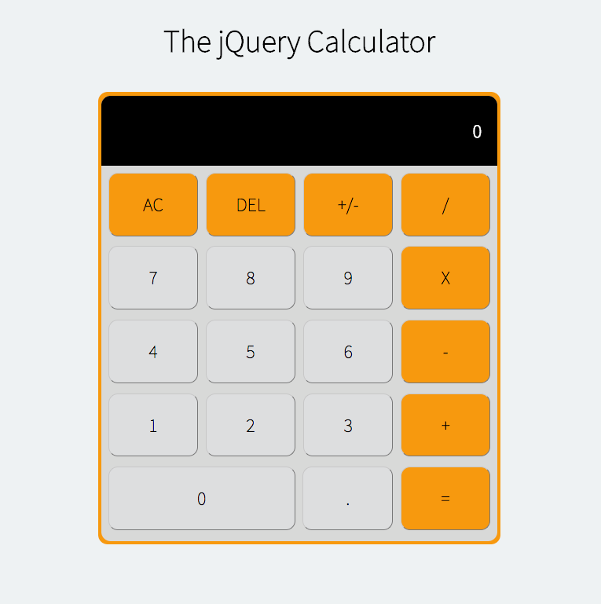
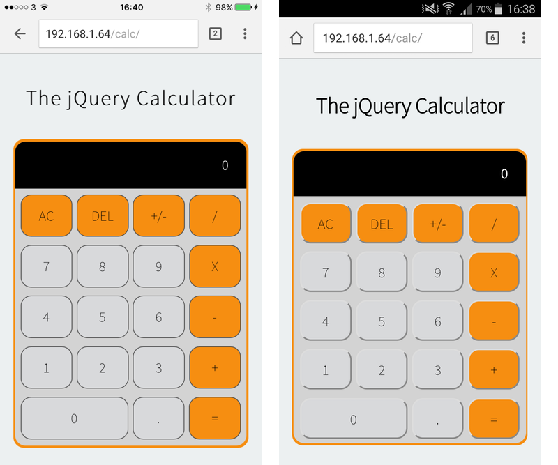
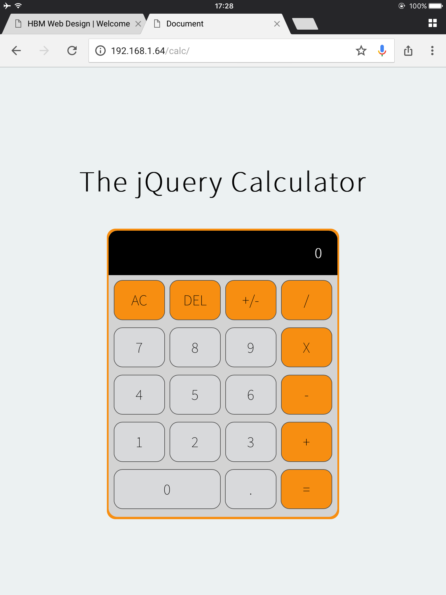

# responsive-calculator

A responsive calculator written primarily with the jQuery JavaScript library.

A screenshot from a 1920x1080 computer screen:

Screenshots taked from iOS and Android phones:

A screenshot taken from an iPad:

