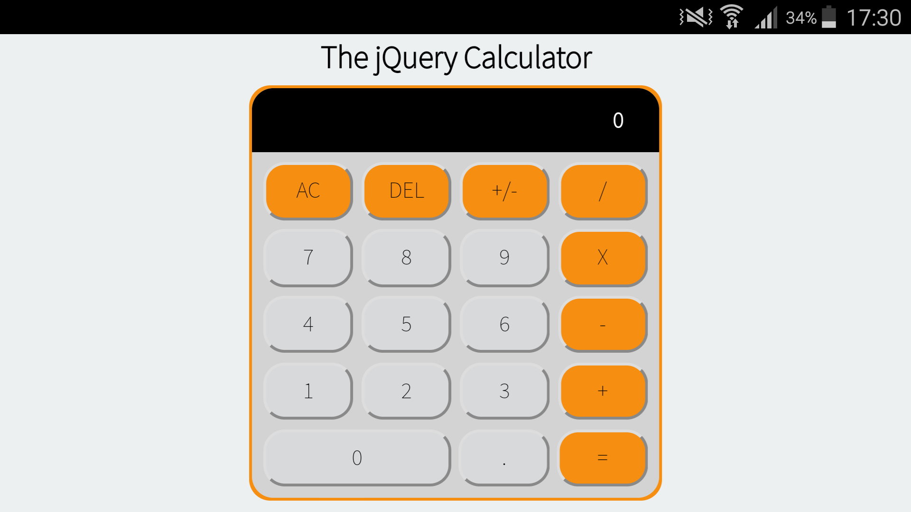

# responsive-calculator

A responsive calculator written primarily with the jQuery JavaScript library.
The calculator can scale down to smaller devices from 220px
phones in any orientation, to 4k monitors.

A screenshot from a 1920x1080 computer screen:

Screenshots taked from iOS and Android phones:

Screenshot taked from an Android phone in landscape mode:

A screenshot taken from an iPad:

